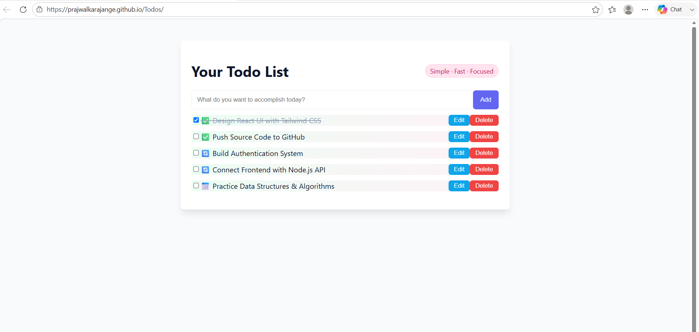

# 📝 React Todo Application

A simple and responsive Todo Application built with React that helps users organize and manage their daily tasks efficiently.

## 🚀 Live Demo

🔗 https://prajwalkarajange.github.io/Todos/

## ✨ Features

- Add new tasks
- Mark tasks as completed
- Delete tasks
- Responsive design
- Fast and user-friendly interface

## 🛠️ Technologies Used

- React.js
- Vite
- JavaScript (ES6+)
- Tailwind CSS
- HTML5
- CSS3

## 📦 Installation

Clone the repository:

```bash
git clone https://github.com/PrajwalKarajange/Todos.git
```

Navigate to the project directory:

```bash
cd Todos
```

Install dependencies:

```bash
npm install
```

Start the development server:

```bash
npm run dev
```

## 🎯 Usage

1. Enter a task in the input field.
2. Click the **Add** button to create a new task.
3. Mark tasks as completed when finished.
4. Delete tasks when they are no longer needed.

## 📁 Project Structure

```text
Todos/
├── src/
│   ├── assets/
│   ├── App.jsx
│   ├── main.jsx
│   ├── index.css
│   └── tailwind.css
├── index.html
├── package.json
└── vite.config.js
```

## 📸 Screenshot
Add a screenshot of the application here:



## 🔮 Future Enhancements

- Edit existing tasks
- Task priorities
- Due dates and reminders
- Dark mode support
- Drag and drop task management

## 👨‍💻 Author

**Prajwal Karajange**

GitHub: https://github.com/PrajwalKarajange

## 📄 License

This project is licensed under the MIT License.
